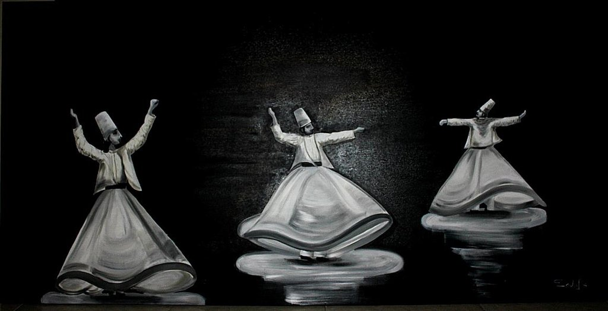
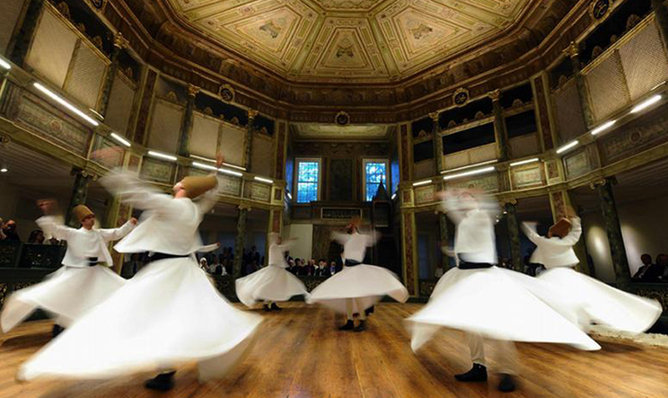

# SUFISME  

  

**Nama:Risky.H**  
**Kelas:TI.20.A1**  

# السلام عليكم ورحمة الله وبركاته  

* *Tasawuf* (Tasawwuf) atau Sufisme *(bahasa Arab: تصوف, )* adalah ilmu untuk mengetahui bagaimana cara menyucikan **jiwa**, menjernihan **akhlaq**, membangun **dhahir** dan **batin** serta untuk memperoleh kebahagian yang abadi.  

  

*Pengikut Sufisme percaya bahwa mereka dapat menjadi lebih dekat kepada Allah melalui **pemurnian** dan **introspeksi batin**. Mereka melakukan ini dengan bermeditasi dan menerima bimbingan dari pemimpin spiritual mereka, atau **“mursyid”** (pemandu).*  

*Pengikut **tasawuf** mengikuti lima pilar rukun Islam seperti halnya orang-orang Muslim lainnya. Mereka menyatakan iman kepada satu Tuhan **Allah** dan **Muhammad** sebagai utusannya, shalat lima kali sehari, memberi sedekah, dan melakukan perjalanan haji ke Mekkah.*  

*“Tidak ada karakteristik praktik atau kepercayaan semua **sufi**. Ini terlalu beragam untuk itu,” katanya kepada Deutsche Welle (DW).*  

  

# Asal usul Sufisme  

*Tasawuf muncul setelah kematian **Nabi Muhamad pada tahun 632**, namun tidak berkembang menjadi ajaran yang solid sampai abad ke-12.*  

*Orde terbentuk di sekitar pendiri **(spiritual)**, yang mendapatkan status orang suci dan tempat-tempat suci yang dibangun atas nama mereka. Ada puluhan orde dan cabang sufi.*  

*Sufisme menyebar ke seluruh dunia **(Muslim)**, menjadi komponen utama praktik keagamaan banyak orang dari Indonesia dan Asia Selatan hingga Afrika dan Balkan.*  

*Pemuka sufi terkadang dekat dengan penguasa yang berkuasa seperti Kekhilafahan (Turki Utsmani), yang membantu penyebaran dan pengaruhnya.*  

*Saat menyebar, Sufisme sering menyesuaikan diri dan memasukkan kepercayaan dan kebiasaan lokal yang membuatnya populer, namun kemudian akan dipandang oleh kelompok ekstremis Islam sebagai (bid’ah atau aliran sesat).*  

# SEKIAN DARI SAYA TERIMA KASIH  